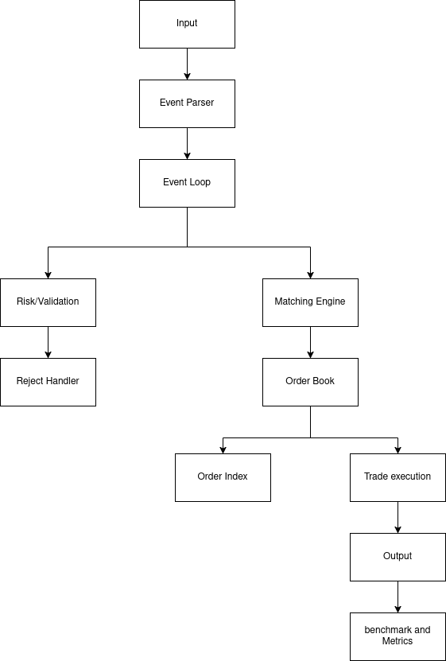

# Order Book Engine

A C++ order book matching engine focused on deterministic behavior and performance.

This project attempts to implement the core mechanics of an exchange-style matching engine.

## Features

- Limit buy and sell orders
- Price-time priority matching
- Partial and full fills
- Best bid / best ask tracking
- Aggregate quantity at price level
- Trade generation on match
- Deterministic matching behavior
- Unit testing with GoogleTest

## Why I Built This

I’m building this project to learn: 

- Trading systems and market microstructure
- Performance-oriented C++
- Data structure in latency-sensitive environments

## Setup

1. `cmake -S . -B build`
2. `cmake --build build`
3. `ctest --test-dir build`

## Diagram

